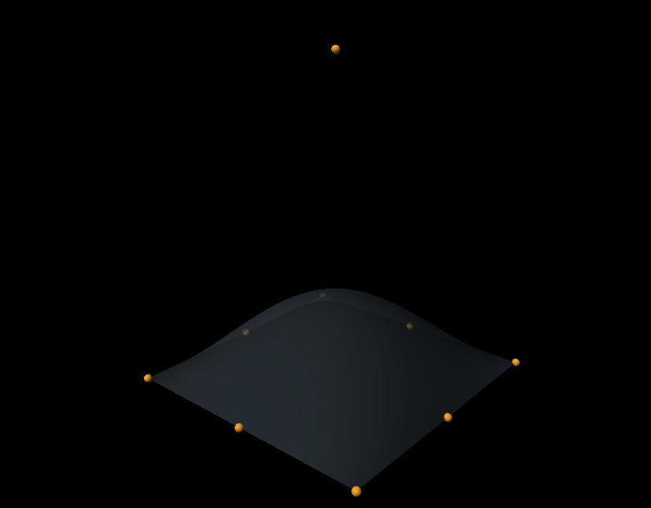

# NURBS Surfaces

Interactive NURBS surface visualization built with C++ and OpenGL. Control points are displayed as spheres that you can select and drag with the mouse to reshape the surface in real time.



## Features

- Basis function evaluation using Cox–de Boor recursion.
- Triangle mesh generation from a NURBS surface.
- Control point selection using raycasting.
- Control point dragging along a plane parallel to the screen, with geometry and normal updates.
- Camera controls, directional lighting, and shadow mapping.

## Build and Run

Requires a C++17 compiler, CMake 3.16+, OpenGL 4.5, GLFW, GLEW, and GLM.

Install dependencies on Ubuntu/Debian:

```bash
sudo apt install build-essential cmake libgl1-mesa-dev libglfw3-dev libglew-dev libglm-dev
```

From the project root:

```bash
cmake -S . -B build
cmake --build build -j4
./build/nurbs_surface
```

Run the application from the project root or the `build` directory so it can find the `Shaders` folder. CMake copies the shaders into `build` during the build process.

## Controls

| Action                 | Control                                        |
| ---------------------- | ---------------------------------------------- |
| Move the camera        | W, A, S, D                                     |
| Rotate the camera      | Hold the right mouse button and move the mouse |
| Select a control point | Left-click a sphere                            |
| Drag a control point   | Hold the left mouse button and move the mouse  |
| Exit                   | Esc                                            |

The selected point is highlighted in green. Picking checks intersections with the spheres and does not account for occlusion by the surface.

## Console Example

`Computational/test.cpp` provides a simple example that evaluates the surface and prints its coordinates:

```bash
cmake --build build --target nurbs_test
./build/nurbs_test
```
